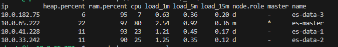

# Elasticsearch Cluster Deployment (AWS EC2 + Docker)

This guide provides detailed, step-by-step instructions to deploy an Elasticsearch cluster using Docker on AWS EC2 instances. The setup includes:

- 1 Master Node
- 3 Data Nodes
- Kibana for visualization

All services are deployed using Docker Compose files stored under the `ymls/` directory.

---

## 1. AWS Security Group Configuration

Create a new security group for your EC2 instances with the following **inbound rules**:

| Type          | Protocol | Port Range | Source                 | Description                  |
|---------------|----------|-------------|-------------------------|------------------------------|
| SSH           | TCP      | 22          | Your IP                | SSH Access                   |
| Custom TCP    | TCP      | 9200        | Your IP                | Elasticsearch API Access     |
| Custom TCP    | TCP      | 5601        | Your IP                | Kibana Web UI                |
| Custom TCP    | TCP      | 9200–9300   | Same Security Group    | Node-to-node communication   |
| All ICMP      | ICMP     | All         | Same Security Group    | Ping/Health check traffic    |

> Outbound rules should remain open (0.0.0.0/0) for internet access.

---

## 2. Prerequisites

### EC2 Instance Setup

- OS: Ubuntu 22.04 (recommended)
- All nodes must be in the same VPC and subnet
- Ensure Public IP is enabled (for master node)

---

## 3. Install Docker & Docker Compose on All Nodes

SSH into each EC2 instance:

```bash
ssh -i <your-key.pem> ubuntu@<EC2_PUBLIC_IP>
```

Run the following commands to install Docker:

```bash
sudo apt update && sudo apt upgrade -y
sudo apt install docker.io docker-compose -y
sudo usermod -aG docker $USER
newgrp docker
```

Increase the default memory map count required by Elasticsearch:

```bash
echo "vm.max_map_count=262144" | sudo tee -a /etc/sysctl.conf
sudo sysctl -p
```

---

## 4. Elasticsearch Master Node

Use the `ymls/docker-compose-master.yml` file on the master EC2 node.

```bash
docker-compose -f ymls/docker-compose-master.yml up -d
```

The file configures:

- Elasticsearch master node (`es-master`)
- Kibana

Verify the service:

```bash
curl http://localhost:9200
```

---

## 5. Elasticsearch Data Nodes

Each data node will use a different Docker Compose file located in the `ymls/` directory:

- `docker-compose-data1.yml`
- `docker-compose-data2.yml`
- `docker-compose-data3.yml` (if needed)

On each data node:

```bash
docker-compose -f ymls/docker-compose-dataX.yml up -d
```

Replace `X` with 1, 2, or 3 based on the node.

---

## 6. Validate Cluster Status

Run the following from the master node:

```bash
curl http://localhost:9200/_cat/nodes?v
curl http://localhost:9200/_cat/shards?v
curl http://localhost:9200/_cluster/health?pretty
```

After installation completes, you should see an output similar to the image below (run from the **master node**):



---

## 7. Access Kibana

To access Kibana from a browser:

```
http://<MASTER_PUBLIC_IP>:5601
```

---

## 8. Folder Overview

| File                          | Description                               |
|-------------------------------|-------------------------------------------|
| `ymls/docker-compose-master.yml`  | Runs Elasticsearch master and Kibana     |
| `ymls/docker-compose-data1.yml`   | Data node 1 configuration                |
| `ymls/docker-compose-data2.yml`   | Data node 2 configuration                |
| `ymls/docker-compose-data3.yml`   | (Optional) Data node 3 configuration     |

---

## 9. Troubleshooting

### Check running containers:
```bash
docker ps
```

### View logs of a container:
```bash
docker logs <container_name>
```

### Restart containers:
```bash
docker-compose -f ymls/<file>.yml restart
```

### Shut down containers:
```bash
docker-compose -f ymls/<file>.yml down
```

---

## 10. Next Steps

You can now:

- Index and query data
- Integrate Logstash or Beats
- Use Kibana for dashboards and visualizations
